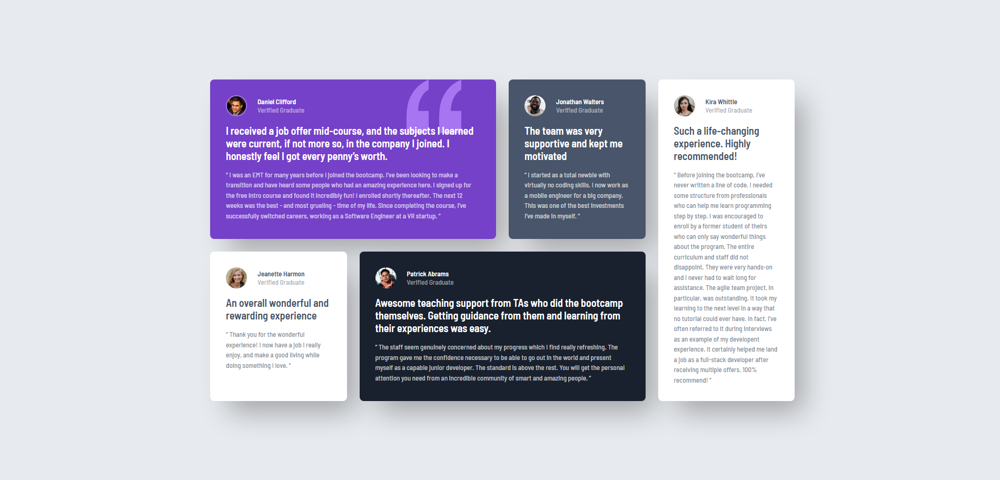

Frontend Mentor - Решение секции с сеткой отзывов
Это решение задачи Testimonials grid section challenge на Frontend Mentor. Проекты Frontend Mentor помогают оттачивать навыки верстки, создавая реалистичные интерфейсы.

Обзор
Задача
Пользователи должны иметь возможность:

Просматривать оптимальный макет сайта в зависимости от размера экрана их устройства (адаптивность от мобильной версии до десктопа).

Скриншот

Ссылки
URL решения: https://github.com/TheTaff/testimonials-grid-section
Живой сайт: https://thetaff.github.io/testimonials-grid-section/

Мой процесс
Инструменты
Семантическая верстка HTML5

Свойства CSS (Custom Properties)

Flexbox (для центрирования контента на странице)

CSS Grid (основа макета)

Методология Mobile-first (сначала для телефонов, затем через @media для ПК)

Чему я научился
В этом проекте я глубоко погрузился в работу с CSS Grid. Самым сложным и интересным было позиционирование карточек по линиям сетки, чтобы создать асимметричный макет.

Я освоил управление областями через координаты линий:

.card--white2 {
    grid-column: 4 / 5;
    grid-row: 1 / 3;
}

Также я научился работать с декоративными фоновыми изображениями, которые не должны мешать основному тексту:

.card--purple {
    background-image: url('./images/bg-pattern-quotation.svg');
    background-repeat: no-repeat;
    background-position: top 0 right 15%;
}

Дальнейшее развитие
В следующих проектах я планирую:

Изучить способ grid-template-areas, чтобы сравнить его с позиционированием по линиям.

Поработать над более сложными анимациями при наведении (hover).

Углубиться в методологию БЭМ для именования классов.

Сотрудничество с AI
Для реализации этого проекта я использовал ИИ-помощника Gemini.

Как это помогло: Помощь в отладке сложных сетки Grid, объяснение разницы между grid-column: span и позиционированием по линиям, а также советы по улучшению теней (box-shadow).

Результат: Процесс обучения пошел быстрее, так как я получал мгновенные объяснения сложных свойств CSS на примерах моего кода.